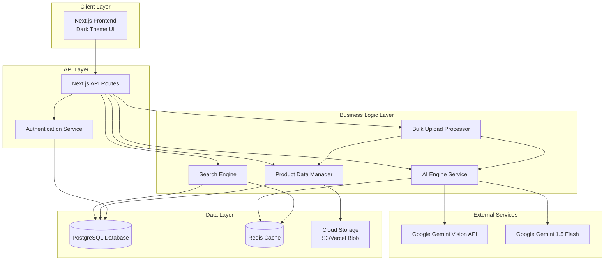
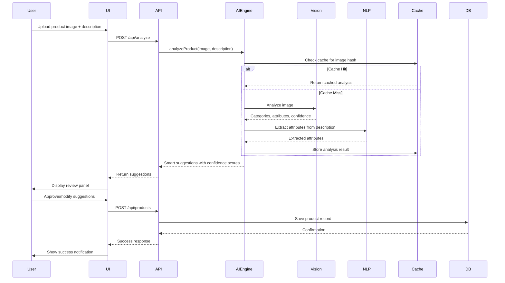
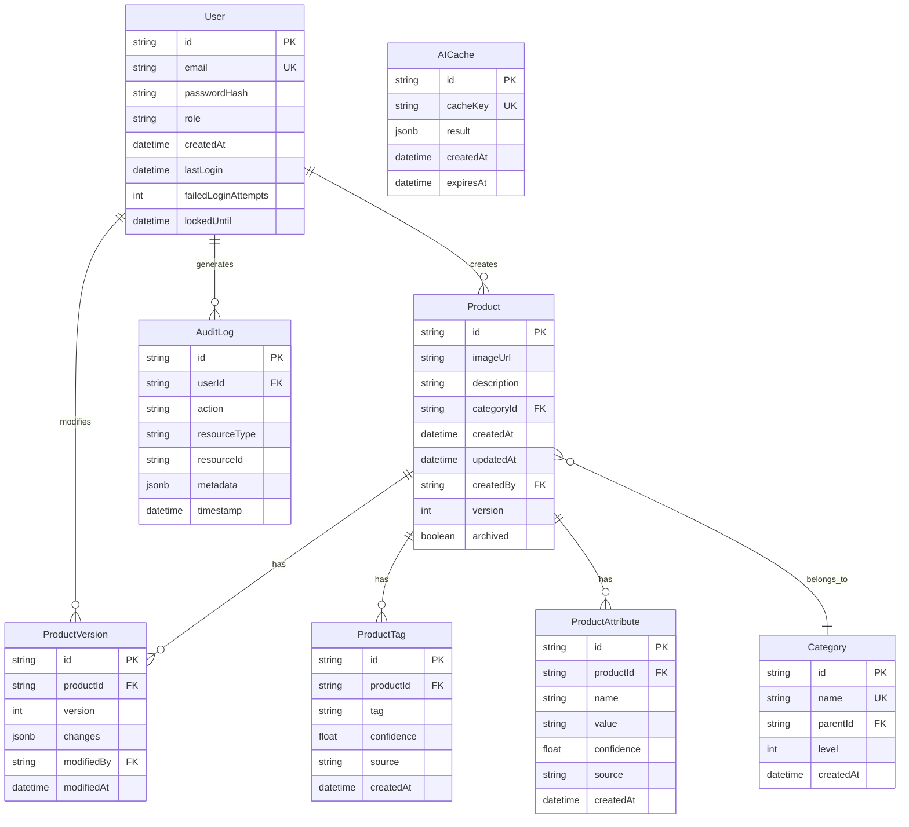
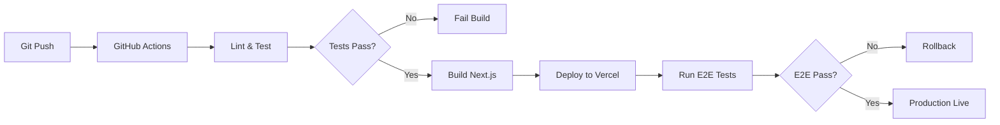

# Design Document: Smart AI Cataloging Application

## Overview

The Smart AI Cataloging Application is a full-stack web application that automates inventory management through AI-powered product classification. The system combines Computer Vision and Natural Language Processing to analyze product images and descriptions, automatically generating categories, tags, and attributes while maintaining data accuracy through human-in-the-loop review.

**Implementation Status**: Core features implemented including authentication, AI analysis, product management, search, and dark-themed UI. The application is production-ready with all essential functionality operational.

### Key Design Goals

- **Performance**: Sub-5-second AI analysis, sub-500ms search responses, 90+ Lighthouse score
- **Scalability**: Support for 100,000+ product catalogs with parallel bulk processing
- **Reliability**: Robust error handling, request queuing, and automatic retries
- **User Experience**: Dark-themed, responsive interface with real-time updates
- **Data Integrity**: Version history, audit logging, and transactional consistency

### Technology Stack

- **Frontend**: Next.js 15+ with React 19, TypeScript, Tailwind CSS
- **Backend**: Next.js API Routes with serverless functions
- **Database**: PostgreSQL with Prisma ORM v5.22.0
- **AI Services**: Google Gemini 1.5 Flash for both Vision and NLP
- **Storage**: Base64 image storage (Vercel Blob ready for production)
- **Caching**: Redis (Upstash) for AI response caching and session management
- **Authentication**: NextAuth.js v5 (beta) with bcrypt password hashing

## Architecture

### System Architecture

The application follows a modern serverless architecture with clear separation between presentation, business logic, and data layers.



### Component Architecture

```mermaid
graph LR
    subgraph "Frontend Components"
        Dashboard[Inventory Dashboard]
        ProductGrid[Product Grid]
        SearchBar[Search & Filter]
        UploadForm[Upload Form]
        ReviewPanel[AI Review Panel]
        EditModal[Edit Modal]
    end
    
    subgraph "API Endpoints"
        ProductAPI[/api/products]
        AnalyzeAPI[/api/analyze]
        BulkAPI[/api/bulk-upload]
        SearchAPI[/api/search]
        ExportAPI[/api/export]
        AuthAPI[/api/auth]
    end
    
    Dashboard --> ProductGrid
    Dashboard --> SearchBar
    Dashboard --> UploadForm
    
    ProductGrid --> ProductAPI
    UploadForm --> AnalyzeAPI
    UploadForm --> BulkAPI
    SearchBar --> SearchAPI
    ReviewPanel --> ProductAPI
    EditModal --> ProductAPI
```

### Data Flow: Product Upload and Analysis



## Components and Interfaces

### Frontend Components

#### 1. Inventory Dashboard Component

**Purpose**: Main application interface for viewing and managing product catalog

**Props**:
```typescript
interface DashboardProps {
  initialProducts: Product[];
  userRole: 'admin' | 'manager' | 'viewer';
  filters?: FilterOptions;
}
```

**State Management**:
- Product list with infinite scroll pagination
- Active filters and search query
- Loading states for async operations
- Real-time updates via optimistic UI updates

**Key Features**:
- Grid layout with 20 products per page
- Real-time search with 500ms debounce
- Filter sidebar for categories, attributes, date ranges
- Dark theme with WCAG AA contrast ratios

#### 2. AI Review Panel Component

**Purpose**: Display AI-generated suggestions for user review and approval

**Props**:
```typescript
interface ReviewPanelProps {
  suggestions: SmartSuggestion[];
  onAccept: (suggestion: SmartSuggestion) => void;
  onReject: (suggestionId: string) => void;
  onModify: (suggestionId: string, newValue: string) => void;
}

interface SmartSuggestion {
  id: string;
  type: 'category' | 'tag' | 'attribute';
  value: string;
  confidence: number;
  field: string;
}
```

**Visual Design**:
- Confidence scores displayed as percentage with color coding
- Yellow highlight for suggestions below 70% confidence
- Individual accept/reject/modify actions per suggestion
- Batch accept all high-confidence suggestions

#### 3. Bulk Upload Component

**Purpose**: Handle CSV file uploads and display processing progress

**Props**:
```typescript
interface BulkUploadProps {
  onUploadComplete: (summary: UploadSummary) => void;
  maxBatchSize: number; // 1000
}

interface UploadSummary {
  total: number;
  successful: number;
  failed: number;
  pendingReview: number;
  errors: UploadError[];
}
```

**Features**:
- CSV file validation and parsing
- Real-time progress bar with item counts
- Parallel processing indicator (max 10 concurrent)
- Downloadable error report for failed items

#### 4. Product Edit Modal Component

**Purpose**: Inline editing interface for product records

**Props**:
```typescript
interface EditModalProps {
  product: Product;
  onSave: (updates: Partial<Product>) => Promise<void>;
  onCancel: () => void;
  canEdit: boolean;
}
```

**Validation**:
- Required field validation before save
- Custom tag addition beyond AI suggestions
- Image upload with preview
- Version history display

### Backend Services

#### 1. AI Engine Service

**Purpose**: Orchestrate AI analysis of product images and descriptions

**Interface**:
```typescript
class AIEngineService {
  async analyzeProduct(
    image: Buffer | string,
    description: string,
    options?: AnalysisOptions
  ): Promise<AnalysisResult>;
  
  async analyzeImage(image: Buffer | string): Promise<ImageAnalysis>;
  
  async extractAttributes(description: string): Promise<AttributeExtraction>;
  
  async getCachedAnalysis(imageHash: string): Promise<AnalysisResult | null>;
  
  async cacheAnalysis(imageHash: string, result: AnalysisResult): Promise<void>;
}

interface AnalysisResult {
  categories: CategorySuggestion[];
  tags: TagSuggestion[];
  attributes: AttributeSuggestion[];
  processingTime: number;
}

interface CategorySuggestion {
  name: string;
  confidence: number;
  isPrimary: boolean;
}

interface AttributeSuggestion {
  name: string;
  value: string;
  confidence: number;
  source: 'image' | 'text' | 'both';
}
```

**Key Responsibilities**:
- Image analysis via Google Gemini 1.5 Flash (unified model for vision and text)
- Text analysis via Google Gemini 1.5 Flash
- Response caching with Redis using SHA-256 hash keys
- Rate limiting (100 requests/minute) with request counting
- Retry logic with exponential backoff (3 attempts)
- Error handling and fallback to manual entry

**Caching Strategy**:
- Cache key: SHA-256 hash of image (base64) + description
- TTL: 30 days for analysis results (configurable via CacheService.AI_ANALYSIS_TTL)
- Cache invalidation on model configuration changes

**Implementation Notes**:
- Uses Google Gemini 1.5 Flash model for both image and text analysis
- Images processed as base64-encoded data URLs
- Parallel processing of image and text analysis for performance
- In-memory request counting for rate limiting (resets every 60 seconds)

#### 2. Search Engine Service

**Purpose**: Provide fast, relevant product search with fuzzy matching

**Interface**:
```typescript
class SearchEngineService {
  async search(
    query: string,
    filters: FilterOptions,
    pagination: PaginationOptions
  ): Promise<SearchResult>;
  
  async buildSearchIndex(): Promise<void>;
  
  async updateProductIndex(productId: string): Promise<void>;
}

interface SearchResult {
  products: Product[];
  total: number;
  facets: SearchFacets;
  executionTime: number;
}

interface FilterOptions {
  categories?: string[];
  attributes?: Record<string, string[]>;
  dateRange?: { start: Date; end: Date };
}

interface SearchFacets {
  categories: { name: string; count: number }[];
  attributes: Record<string, { value: string; count: number }[]>;
}
```

**Search Algorithm**:
1. Parse query and extract search terms
2. Search across categories (weight: 3x), tags (weight: 2x), attributes (weight: 1.5x), descriptions (weight: 1x)
3. Apply fuzzy matching with Levenshtein distance ≤ 2
4. Rank results by weighted relevance score
5. Apply filters to narrow results
6. Return paginated results with facets

**Performance Optimizations**:
- PostgreSQL full-text search with GIN indexes
- Materialized view for frequently accessed aggregations
- Query result caching (5-minute TTL)
- Database query timeout: 500ms

#### 3. Bulk Upload Processor

**Purpose**: Handle parallel processing of multiple product uploads

**Interface**:
```typescript
class BulkUploadProcessor {
  async processBatch(
    products: ProductInput[],
    userId: string,
    onProgress?: (progress: ProgressUpdate) => void
  ): Promise<BatchResult>;
  
  async parseCSV(file: Buffer): Promise<ProductInput[]>;
  
  async validateProduct(product: ProductInput): Promise<ValidationResult>;
}

interface ProductInput {
  imageUrl?: string;
  imageFile?: Buffer;
  description: string;
  customFields?: Record<string, any>;
}

interface BatchResult {
  successful: ProcessedProduct[];
  failed: FailedProduct[];
  pendingReview: ProcessedProduct[];
  summary: UploadSummary;
}

interface ProgressUpdate {
  processed: number;
  total: number;
  currentItem: string;
}
```

**Processing Strategy**:
- Parse CSV and validate format
- Process products in parallel (max 10 concurrent)
- Use Promise.allSettled for fault tolerance
- Continue processing on individual failures
- Generate detailed error report
- Queue low-confidence results for review

#### 4. Product Data Manager

**Purpose**: Manage CRUD operations for product records with version history

**Interface**:
```typescript
class ProductDataManager {
  async createProduct(data: CreateProductInput, userId: string): Promise<Product>;
  
  async updateProduct(
    id: string,
    updates: Partial<Product>,
    userId: string
  ): Promise<Product>;
  
  async deleteProduct(id: string, userId: string): Promise<void>;
  
  async getProduct(id: string): Promise<Product | null>;
  
  async listProducts(options: ListOptions): Promise<PaginatedProducts>;
  
  async getVersionHistory(productId: string): Promise<ProductVersion[]>;
  
  async batchUpdate(
    productIds: string[],
    updates: Partial<Product>,
    userId: string
  ): Promise<BatchUpdateResult>;
}

interface Product {
  id: string;
  imageUrl: string;
  description: string;
  categories: string[];
  tags: string[];
  attributes: Record<string, string>;
  createdAt: Date;
  updatedAt: Date;
  createdBy: string;
  version: number;
}

interface ProductVersion {
  version: number;
  changes: Record<string, any>;
  modifiedBy: string;
  modifiedAt: Date;
}
```

**Data Integrity**:
- Transactional updates with rollback on failure
- Unique constraint on product identifiers
- Version history tracking
- Audit logging for all modifications
- Soft delete (archive) instead of permanent deletion

### API Endpoints

#### POST /api/analyze

Analyze product image and description to generate AI suggestions

**Request**:
```typescript
{
  image: string | File; // Base64 or multipart file
  description: string;
  options?: {
    confidenceThreshold?: number;
    customCategories?: string[];
  }
}
```

**Response**:
```typescript
{
  suggestions: {
    categories: CategorySuggestion[];
    tags: TagSuggestion[];
    attributes: AttributeSuggestion[];
  };
  processingTime: number;
  cached: boolean;
}
```

**Error Codes**:
- 400: Invalid image format or missing description
- 413: Image file too large (>10MB)
- 429: Rate limit exceeded
- 503: AI service unavailable

#### POST /api/products

Create or update product record

**Request**:
```typescript
{
  id?: string; // For updates
  imageUrl: string;
  description: string;
  categories: string[];
  tags: string[];
  attributes: Record<string, string>;
  corrections?: SmartSuggestion[]; // For ML feedback
}
```

**Response**:
```typescript
{
  product: Product;
  version: number;
}
```

#### POST /api/bulk-upload

Process bulk product upload from CSV

**Request**: Multipart form data with CSV file

**CSV Format**:
```csv
image_url,description,custom_field_1,custom_field_2
https://example.com/img1.jpg,"Product description",value1,value2
```

**Response**:
```typescript
{
  jobId: string;
  status: 'processing' | 'completed';
  summary: UploadSummary;
}
```

**WebSocket Updates**: Real-time progress via `/api/bulk-upload/progress?jobId={jobId}`

#### GET /api/search

Search and filter products

**Query Parameters**:
```typescript
{
  q?: string; // Search query
  categories?: string[]; // Filter by categories
  attributes?: Record<string, string[]>; // Filter by attributes
  dateFrom?: string; // ISO date
  dateTo?: string; // ISO date
  page?: number;
  limit?: number; // Max 100
  sortBy?: 'relevance' | 'date' | 'name';
  sortOrder?: 'asc' | 'desc';
}
```

**Response**:
```typescript
{
  products: Product[];
  total: number;
  page: number;
  facets: SearchFacets;
  executionTime: number;
}
```

#### GET /api/export

Export product catalog

**Query Parameters**:
```typescript
{
  format: 'csv' | 'json' | 'pdf';
  filters?: FilterOptions; // Same as search
  includeImages?: boolean;
}
```

**Response**: File download with appropriate Content-Type

## Data Models

### Database Schema



### TypeScript Data Models

```typescript
// User Model
interface User {
  id: string;
  email: string;
  passwordHash: string;
  role: 'admin' | 'manager' | 'viewer';
  createdAt: Date;
  lastLogin: Date | null;
  failedLoginAttempts: number;
  lockedUntil: Date | null;
}

// Product Model
interface Product {
  id: string;
  imageUrl: string;
  description: string;
  categoryId: string;
  category?: Category;
  tags: ProductTag[];
  attributes: ProductAttribute[];
  createdAt: Date;
  updatedAt: Date;
  createdBy: string;
  creator?: User;
  version: number;
  archived: boolean;
}

// Category Model
interface Category {
  id: string;
  name: string;
  parentId: string | null;
  parent?: Category;
  level: number;
  createdAt: Date;
}

// Product Tag Model
interface ProductTag {
  id: string;
  productId: string;
  tag: string;
  confidence: number;
  source: 'ai' | 'user' | 'bulk';
  createdAt: Date;
}

// Product Attribute Model
interface ProductAttribute {
  id: string;
  productId: string;
  name: string;
  value: string;
  confidence: number;
  source: 'image' | 'text' | 'user';
  createdAt: Date;
}

// Product Version Model
interface ProductVersion {
  id: string;
  productId: string;
  version: number;
  changes: Record<string, { old: any; new: any }>;
  modifiedBy: string;
  modifier?: User;
  modifiedAt: Date;
}

// Audit Log Model
interface AuditLog {
  id: string;
  userId: string;
  user?: User;
  action: 'create' | 'update' | 'delete' | 'export' | 'login' | 'logout';
  resourceType: 'product' | 'user' | 'category' | 'config';
  resourceId: string;
  metadata: Record<string, any>;
  timestamp: Date;
}

// AI Cache Model
interface AICache {
  id: string;
  cacheKey: string;
  result: AnalysisResult;
  createdAt: Date;
  expiresAt: Date;
}
```

### Database Indexes

**Performance-Critical Indexes**:

```sql
-- Product search indexes
CREATE INDEX idx_products_category ON products(category_id);
CREATE INDEX idx_products_created_at ON products(created_at DESC);
CREATE INDEX idx_products_archived ON products(archived) WHERE archived = false;

-- Full-text search
CREATE INDEX idx_products_description_fts ON products USING GIN(to_tsvector('english', description));

-- Tag search
CREATE INDEX idx_product_tags_tag ON product_tags(tag);
CREATE INDEX idx_product_tags_product ON product_tags(product_id);

-- Attribute search
CREATE INDEX idx_product_attributes_name_value ON product_attributes(name, value);
CREATE INDEX idx_product_attributes_product ON product_attributes(product_id);

-- User authentication
CREATE UNIQUE INDEX idx_users_email ON users(email);

-- Audit log queries
CREATE INDEX idx_audit_logs_user_timestamp ON audit_logs(user_id, timestamp DESC);
CREATE INDEX idx_audit_logs_resource ON audit_logs(resource_type, resource_id);

-- AI cache lookup
CREATE UNIQUE INDEX idx_ai_cache_key ON ai_cache(cache_key);
CREATE INDEX idx_ai_cache_expires ON ai_cache(expires_at);
```


## Correctness Properties

*A property is a characteristic or behavior that should hold true across all valid executions of a system—essentially, a formal statement about what the system should do. Properties serve as the bridge between human-readable specifications and machine-verifiable correctness guarantees.*

### Property Reflection

After analyzing all acceptance criteria, I identified the following redundancies and consolidations:

**Consolidated Properties**:
- Properties for displaying product information (5.3, 7.1) can be combined into a single property about complete product data display
- Properties for confidence score handling (3.2, 3.3) can be combined into a single property about confidence score display and highlighting
- Properties for error handling (1.4, 2.5, 14.1, 14.2) share common error display patterns and can be consolidated
- Properties for audit logging (7.3, 10.6) both test version/audit history and can be combined
- Properties for export completeness (12.1, 12.3) both test export data integrity

**Eliminated Redundancies**:
- Property 3.1 (display suggestions) is subsumed by 3.2 (display with confidence scores)
- Property 6.4 (filter UI exists) is an implementation detail; 6.5 (filter logic) is the testable behavior
- Property 13.2 (dark theme default) is a simple example, not a universal property

After consolidation, we have 55 unique, non-redundant properties.

### Property 1: Image Analysis Returns Categories

*For any* valid product image uploaded to the system, the AI analysis SHALL return at least one category suggestion with an associated confidence score between 0 and 1.

**Validates: Requirements 1.2**

### Property 2: Invalid Image Error Handling

*For any* corrupted, unreadable, or invalid image data, the AI Engine SHALL return a specific error message indicating the nature of the problem without crashing or hanging.

**Validates: Requirements 1.4, 2.5, 14.1, 14.2**

### Property 3: Visual Attribute Extraction

*For any* valid product image analysis result, the extracted attributes SHALL include at least one attribute from the set {color, shape, material} with confidence scores.

**Validates: Requirements 1.5**


### Property 4: Description Attribute Extraction

*For any* product description containing brand names, materials, or dimensions, the Attribute Extractor SHALL identify and extract these attributes with confidence scores.

**Validates: Requirements 2.1**

### Property 5: Attribute Normalization

*For any* extracted attribute from text or image analysis, the attribute name and value SHALL be normalized to match the consistent terminology defined in the system glossary.

**Validates: Requirements 2.3**

### Property 6: Suggestion Display with Confidence

*For any* completed AI analysis, the system SHALL display all suggestions (categories, tags, attributes) with their confidence scores as percentages, and SHALL highlight suggestions with confidence below 70%.

**Validates: Requirements 3.2, 3.3**

### Property 7: Individual Suggestion Actions

*For any* smart suggestion presented to the user, the interface SHALL provide three distinct actions: accept, reject, and modify, each of which can be invoked independently.

**Validates: Requirements 3.4**

### Property 8: Correction Persistence

*For any* user modification to an AI-generated suggestion, the system SHALL persist the correction to the database for future model improvement feedback.

**Validates: Requirements 3.5**

### Property 9: Explicit Confirmation Required

*For any* product record creation or update, the system SHALL NOT commit changes to the database without explicit user confirmation action.

**Validates: Requirements 3.6**

### Property 10: Concurrent Processing Limit

*For any* bulk upload batch, the system SHALL process products in parallel with a maximum of 10 concurrent operations at any given time.

**Validates: Requirements 4.1**


### Property 11: CSV Format Support

*For any* valid CSV file containing product data with images referenced by URL or file path, the bulk upload utility SHALL successfully parse and process the file.

**Validates: Requirements 4.2**

### Property 12: Progress Display During Bulk Upload

*For any* bulk upload operation in progress, the dashboard SHALL display real-time progress information including the count of items processed and remaining.

**Validates: Requirements 4.3**

### Property 13: Fault Tolerance in Bulk Processing

*For any* bulk upload batch where one or more products fail processing, the system SHALL continue processing all remaining products and report failures separately without halting the entire batch.

**Validates: Requirements 4.4**

### Property 14: Bulk Upload Summary Generation

*For any* completed bulk upload operation, the system SHALL generate a summary report containing counts of successful, failed, and pending review items.

**Validates: Requirements 4.5**

### Property 15: Batch Size Limit Enforcement

*For any* bulk upload request, the system SHALL accept batches containing up to 1000 products and SHALL reject batches exceeding this limit with an appropriate error message.

**Validates: Requirements 4.6**

### Property 16: Complete Product Display

*For any* product displayed in the dashboard grid or edit interface, the system SHALL render all product fields including thumbnail image, description, categories, tags, and attributes.

**Validates: Requirements 5.3, 7.1**

### Property 17: Infinite Scroll Pagination

*For any* scroll event that reaches the bottom of the product grid, the system SHALL load exactly 20 additional products (or remaining products if fewer than 20 remain).

**Validates: Requirements 5.4**


### Property 18: Real-Time UI Updates

*For any* product record update operation, the dashboard SHALL reflect the changes in the UI without requiring a full page refresh.

**Validates: Requirements 5.5**

### Property 19: WCAG AA Contrast Compliance

*For any* text element displayed in the dark-themed interface, the contrast ratio between text and background SHALL meet or exceed WCAG AA standards (4.5:1 for normal text, 3:1 for large text).

**Validates: Requirements 5.6**

### Property 20: Search Result Relevance Ranking

*For any* search query that returns multiple products, the results SHALL be ordered by relevance score in descending order.

**Validates: Requirements 6.1**

### Property 21: Multi-Field Search Coverage

*For any* search query, the search engine SHALL search across all of the following fields: categories, tags, attributes, and product descriptions, returning matches from any field.

**Validates: Requirements 6.2**

### Property 22: Category Match Prioritization

*For any* search query that matches both a category name (exact match) and a tag (partial match), the product with the category match SHALL rank higher in results than the product with only the tag match.

**Validates: Requirements 6.3**

### Property 23: Multi-Filter AND Logic

*For any* search with multiple filters applied (categories, attributes, date ranges), the system SHALL return only products that match ALL selected filter criteria (intersection, not union).

**Validates: Requirements 6.5**

### Property 24: Fuzzy Search Matching

*For any* search query with minor spelling variations (Levenshtein distance ≤ 2), the search engine SHALL return relevant results that match the intended term.

**Validates: Requirements 6.6**


### Property 25: Required Field Validation

*For any* product record update attempt, the system SHALL validate that all required fields are present and non-empty before allowing the update to proceed, rejecting invalid updates with specific error messages.

**Validates: Requirements 7.2**

### Property 26: Version History and Audit Logging

*For any* product record modification (create, update, delete), the system SHALL create both a version history entry with change details and an audit log entry with user identifier and timestamp.

**Validates: Requirements 7.3, 10.6**

### Property 27: Custom Tag Addition

*For any* product record, users SHALL be able to add custom tags that were not generated by AI suggestions, and these tags SHALL be persisted with the product.

**Validates: Requirements 7.4**

### Property 28: Soft Delete with Confirmation

*For any* product deletion request, the system SHALL require explicit user confirmation and SHALL set the archived flag to true rather than permanently removing the record from the database.

**Validates: Requirements 7.5**

### Property 29: Batch Edit Support

*For any* set of selected products, the system SHALL support applying category and tag updates to all selected products simultaneously in a single operation.

**Validates: Requirements 7.6**

### Property 30: Retry with Exponential Backoff

*For any* AI service request that fails, the system SHALL retry the request up to 3 times with exponential backoff delays (e.g., 1s, 2s, 4s) before considering the request permanently failed.

**Validates: Requirements 8.3**

### Property 31: Manual Entry Fallback

*For any* product upload where all AI service retry attempts fail, the system SHALL enable manual product entry mode and SHALL send a notification to system administrators.

**Validates: Requirements 8.4**


### Property 32: Rate Limiting Enforcement

*For any* 60-second time window, the system SHALL send no more than 100 requests to AI service APIs, queuing or delaying additional requests to stay within the limit.

**Validates: Requirements 8.5**

### Property 33: AI Response Caching

*For any* product analysis request with identical image and description inputs (matching cache key), the system SHALL return the cached analysis result without making a new AI API call.

**Validates: Requirements 8.6**

### Property 34: Transaction Rollback on Failure

*For any* database transaction that fails during product record creation or update, the system SHALL rollback all changes to maintain data consistency and SHALL display an error message to the user.

**Validates: Requirements 9.5**

### Property 35: Unique Product Identifier Constraint

*For any* attempt to create a product record with an identifier that already exists in the database, the system SHALL reject the creation and return a unique constraint violation error.

**Validates: Requirements 9.6**

### Property 36: Authentication Required

*For any* request to access the cataloging system, the system SHALL require valid authentication credentials (email and password) and SHALL reject unauthenticated requests.

**Validates: Requirements 10.1**

### Property 37: Role-Based Permission Enforcement

*For any* user with a specific role (admin, manager, viewer), the system SHALL enforce the permissions associated with that role, allowing or denying operations accordingly.

**Validates: Requirements 10.2**

### Property 38: Viewer Role Restrictions

*For any* user with the viewer role, the system SHALL deny all edit and delete operations on product records, returning permission denied errors.

**Validates: Requirements 10.3**


### Property 39: Password Hashing with Bcrypt

*For any* user password stored in the database, the password SHALL be hashed using bcrypt with a minimum of 12 salt rounds, never storing plaintext passwords.

**Validates: Requirements 10.4**

### Property 40: Account Lockout After Failed Attempts

*For any* user account that experiences 5 failed authentication attempts within a 15-minute window, the system SHALL lock the account for 30 minutes, preventing further login attempts.

**Validates: Requirements 10.5**

### Property 41: Optimized Image Format Serving

*For any* product image displayed in the interface, the system SHALL serve the image in WebP format with appropriate fallbacks for browsers that don't support WebP.

**Validates: Requirements 11.3**

### Property 42: Lazy Loading for Off-Screen Images

*For any* product image that is not currently visible in the viewport, the system SHALL defer loading the image until it is scrolled into view or near the viewport boundary.

**Validates: Requirements 11.4**

### Property 43: Export Format Support

*For any* export request, the system SHALL generate valid output files in the requested format (CSV or JSON) containing all product records matching the export criteria.

**Validates: Requirements 12.1, 12.3**

### Property 44: Summary Report Generation

*For any* report generation request, the system SHALL produce a report containing total product count, category distribution statistics, and tagging completeness metrics.

**Validates: Requirements 12.4**

### Property 45: Filtered Export

*For any* export request with active filters applied, the system SHALL export only the subset of products that match the filter criteria, not the entire catalog.

**Validates: Requirements 12.5**


### Property 46: PDF Report with Visualizations

*For any* PDF report generation request, the system SHALL produce a valid PDF file containing charts that visualize inventory statistics (category distribution, tagging completeness).

**Validates: Requirements 12.6**

### Property 47: Responsive Layout Rendering

*For any* viewport width between 320px and 2560px, the dashboard SHALL render without horizontal scrolling, layout breaking, or content overflow, adapting the layout appropriately for the screen size.

**Validates: Requirements 13.1**

### Property 48: Keyboard Navigation Support

*For any* interactive element in the interface (buttons, links, form inputs, modals), the element SHALL be reachable and operable using only keyboard navigation (Tab, Enter, Escape, Arrow keys).

**Validates: Requirements 13.3**

### Property 49: Image Alternative Text

*For any* product image displayed in the interface, the image element SHALL include an alt attribute with descriptive alternative text for screen readers.

**Validates: Requirements 13.4**

### Property 50: Zoom Compatibility

*For any* browser zoom level between 100% and 200%, the interface SHALL remain functional with all interactive elements accessible and readable text.

**Validates: Requirements 13.6**

### Property 51: User-Friendly Error Messages

*For any* error condition encountered during system operation, the system SHALL display a user-friendly error message that explains the issue and suggests corrective actions, avoiding technical jargon.

**Validates: Requirements 14.1**

### Property 52: Toast Notification Auto-Dismiss

*For any* successful operation (product created, updated, deleted), the system SHALL display a toast notification that automatically dismisses after exactly 3 seconds.

**Validates: Requirements 14.3**


### Property 53: Confirmation for Destructive Actions

*For any* irreversible or destructive action (delete product, batch delete, clear filters), the system SHALL display a confirmation dialog requiring explicit user approval before proceeding.

**Validates: Requirements 14.4**

### Property 54: Loading Indicators for Long Operations

*For any* operation that takes longer than 1 second to complete, the system SHALL display a loading indicator (spinner, progress bar, skeleton screen) to inform the user that processing is ongoing.

**Validates: Requirements 14.5**

### Property 55: Network Error Recovery

*For any* network error encountered during an operation, the system SHALL display a retry option to the user and SHALL cache the user's input data to prevent data loss.

**Validates: Requirements 14.6**

### Property 56: Custom Attribute Type Definition

*For any* administrator-defined custom attribute type, the system SHALL allow products to use this attribute type in addition to the default attribute types (color, material, size, brand).

**Validates: Requirements 15.3**

### Property 57: Multi-Language Description Support

*For any* product description in a supported language (English, Spanish, French, German, etc.), the AI Engine SHALL process and extract attributes from the description correctly.

**Validates: Requirements 15.4**

### Property 58: Configuration Change Isolation

*For any* configuration change saved by an administrator (confidence thresholds, custom categories, attribute types), the change SHALL apply only to new product records created after the change, leaving existing product records unaffected.

**Validates: Requirements 15.5**


## Error Handling

### Error Classification

The system implements a comprehensive error handling strategy with four error severity levels:

**1. User Errors (400-level)**
- Invalid input data (malformed images, empty required fields)
- Authentication failures
- Permission denied
- Resource not found
- Validation errors

**2. System Errors (500-level)**
- Database connection failures
- Transaction rollback errors
- Internal service errors
- Unhandled exceptions

**3. External Service Errors**
- AI API unavailable
- AI API rate limit exceeded
- AI API timeout
- Cloud storage failures

**4. Network Errors**
- Connection timeout
- Request aborted
- DNS resolution failure

### Error Handling Patterns

#### 1. AI Service Error Handling

```typescript
async function analyzeWithRetry(
  image: Buffer,
  description: string,
  maxRetries: number = 3
): Promise<AnalysisResult> {
  let lastError: Error;
  
  for (let attempt = 1; attempt <= maxRetries; attempt++) {
    try {
      const result = await aiService.analyze(image, description);
      return result;
    } catch (error) {
      lastError = error;
      
      if (error.code === 'RATE_LIMIT_EXCEEDED') {
        // Wait and retry with exponential backoff
        await sleep(Math.pow(2, attempt) * 1000);
        continue;
      }
      
      if (error.code === 'INVALID_INPUT') {
        // Don't retry user errors
        throw new UserError('Invalid image or description', error);
      }
      
      // Retry transient errors
      if (attempt < maxRetries) {
        await sleep(Math.pow(2, attempt) * 1000);
      }
    }
  }
  
  // All retries exhausted
  logger.error('AI service failed after retries', { error: lastError });
  await notifyAdministrators('AI service failure', lastError);
  throw new ServiceUnavailableError('AI analysis temporarily unavailable');
}
```


#### 2. Database Transaction Error Handling

```typescript
async function updateProductWithTransaction(
  productId: string,
  updates: Partial<Product>,
  userId: string
): Promise<Product> {
  const transaction = await db.beginTransaction();
  
  try {
    // Update product
    const product = await db.products.update(
      { id: productId },
      updates,
      { transaction }
    );
    
    // Create version history
    await db.productVersions.create({
      productId,
      version: product.version + 1,
      changes: calculateChanges(product, updates),
      modifiedBy: userId,
      modifiedAt: new Date()
    }, { transaction });
    
    // Create audit log
    await db.auditLogs.create({
      userId,
      action: 'update',
      resourceType: 'product',
      resourceId: productId,
      metadata: { updates },
      timestamp: new Date()
    }, { transaction });
    
    await transaction.commit();
    return product;
    
  } catch (error) {
    await transaction.rollback();
    logger.error('Product update failed', { productId, error });
    
    if (error.code === 'UNIQUE_CONSTRAINT_VIOLATION') {
      throw new ValidationError('Product identifier already exists');
    }
    
    throw new DatabaseError('Failed to update product', error);
  }
}
```

#### 3. Bulk Upload Error Handling

```typescript
async function processBulkUpload(
  products: ProductInput[],
  userId: string
): Promise<BatchResult> {
  const results = await Promise.allSettled(
    products.map(product => processProduct(product, userId))
  );
  
  const successful: ProcessedProduct[] = [];
  const failed: FailedProduct[] = [];
  const pendingReview: ProcessedProduct[] = [];
  
  results.forEach((result, index) => {
    if (result.status === 'fulfilled') {
      const processed = result.value;
      if (processed.needsReview) {
        pendingReview.push(processed);
      } else {
        successful.push(processed);
      }
    } else {
      failed.push({
        input: products[index],
        error: result.reason.message,
        errorCode: result.reason.code
      });
    }
  });
  
  return {
    successful,
    failed,
    pendingReview,
    summary: {
      total: products.length,
      successful: successful.length,
      failed: failed.length,
      pendingReview: pendingReview.length,
      errors: failed
    }
  };
}
```


#### 4. Frontend Error Handling

```typescript
// Global error boundary for React components
class ErrorBoundary extends React.Component {
  state = { hasError: false, error: null };
  
  static getDerivedStateFromError(error: Error) {
    return { hasError: true, error };
  }
  
  componentDidCatch(error: Error, errorInfo: React.ErrorInfo) {
    logger.error('React error boundary caught error', {
      error,
      errorInfo,
      componentStack: errorInfo.componentStack
    });
  }
  
  render() {
    if (this.state.hasError) {
      return (
        <ErrorDisplay
          message="Something went wrong"
          action="Reload Page"
          onAction={() => window.location.reload()}
        />
      );
    }
    return this.props.children;
  }
}

// API error handling with user-friendly messages
async function handleApiError(error: ApiError): Promise<void> {
  const userMessage = getUserFriendlyMessage(error);
  
  if (error.code === 'NETWORK_ERROR') {
    // Cache user input
    cacheUserInput();
    
    // Show retry option
    showToast({
      type: 'error',
      message: userMessage,
      action: 'Retry',
      onAction: retryLastRequest
    });
  } else if (error.code === 'AUTHENTICATION_FAILED') {
    // Redirect to login
    router.push('/login');
  } else {
    // Generic error display
    showToast({
      type: 'error',
      message: userMessage,
      duration: 5000
    });
  }
  
  // Log error details (not shown to user)
  logger.error('API request failed', {
    endpoint: error.endpoint,
    statusCode: error.statusCode,
    details: error.details
  });
}
```

### Error Message Guidelines

**User-Facing Messages**:
- Clear and concise (under 100 characters)
- Explain what went wrong in plain language
- Suggest corrective action when possible
- Avoid technical jargon and error codes
- Maintain friendly, supportive tone

**Examples**:
- ❌ "Error 500: Internal server error in product.service.ts:142"
- ✅ "We couldn't save your product. Please try again in a moment."

- ❌ "UNIQUE_CONSTRAINT_VIOLATION on products.identifier"
- ✅ "A product with this ID already exists. Please use a different identifier."

- ❌ "Gemini API rate limit exceeded (429)"
- ✅ "We're processing a lot of requests right now. Your product will be analyzed shortly."


## Testing Strategy

### Overview

The testing strategy employs a dual approach combining unit tests for specific examples and edge cases with property-based tests for universal correctness guarantees. This comprehensive approach ensures both concrete behavior validation and broad input coverage.

### Testing Pyramid

```
         /\
        /  \  E2E Tests (10%)
       /____\  - Critical user flows
      /      \ - Cross-browser testing
     /________\ Integration Tests (20%)
    /          \ - API endpoint testing
   /____________\ - Database integration
  /              \ - External service mocking
 /________________\ Unit + Property Tests (70%)
                    - Component logic
                    - Service functions
                    - Property-based validation
```

### Property-Based Testing

**Framework**: fast-check (JavaScript/TypeScript property-based testing library)

**Configuration**:
- Minimum 100 iterations per property test
- Seed-based reproducibility for failed tests
- Shrinking enabled to find minimal failing cases
- Timeout: 30 seconds per property test

**Property Test Structure**:

```typescript
import fc from 'fast-check';

/**
 * Feature: smart-ai-cataloging, Property 33: AI Response Caching
 * For any product analysis request with identical image and description inputs,
 * the system SHALL return the cached analysis result without making a new AI API call.
 */
describe('Property 33: AI Response Caching', () => {
  it('should return cached results for identical inputs', async () => {
    await fc.assert(
      fc.asyncProperty(
        fc.uint8Array({ minLength: 100, maxLength: 1000 }), // Random image data
        fc.string({ minLength: 10, maxLength: 500 }), // Random description
        async (imageData, description) => {
          // First call - should hit AI API
          const result1 = await aiEngine.analyzeProduct(
            Buffer.from(imageData),
            description
          );
          
          // Second call with identical inputs - should use cache
          const apiCallCountBefore = mockAIService.getCallCount();
          const result2 = await aiEngine.analyzeProduct(
            Buffer.from(imageData),
            description
          );
          const apiCallCountAfter = mockAIService.getCallCount();
          
          // Verify no new API call was made
          expect(apiCallCountAfter).toBe(apiCallCountBefore);
          
          // Verify results are identical
          expect(result2).toEqual(result1);
          expect(result2.cached).toBe(true);
        }
      ),
      { numRuns: 100 }
    );
  });
});
```


**Custom Generators for Domain Objects**:

```typescript
// Generator for valid product images
const validImageArbitrary = fc.uint8Array({
  minLength: 1000,
  maxLength: 10000
}).map(data => {
  // Add minimal valid image headers (PNG)
  const header = Buffer.from([137, 80, 78, 71, 13, 10, 26, 10]);
  return Buffer.concat([header, Buffer.from(data)]);
});

// Generator for product descriptions
const productDescriptionArbitrary = fc.record({
  brand: fc.option(fc.constantFrom('Nike', 'Adidas', 'Apple', 'Samsung')),
  material: fc.option(fc.constantFrom('cotton', 'leather', 'plastic', 'metal')),
  color: fc.option(fc.constantFrom('red', 'blue', 'black', 'white')),
  description: fc.string({ minLength: 20, maxLength: 200 })
}).map(parts => {
  const desc = [parts.description];
  if (parts.brand) desc.push(`Brand: ${parts.brand}`);
  if (parts.material) desc.push(`Material: ${parts.material}`);
  if (parts.color) desc.push(`Color: ${parts.color}`);
  return desc.join('. ');
});

// Generator for product records
const productArbitrary = fc.record({
  id: fc.uuid(),
  imageUrl: fc.webUrl(),
  description: productDescriptionArbitrary,
  categoryId: fc.uuid(),
  tags: fc.array(fc.string({ minLength: 3, maxLength: 20 }), { maxLength: 10 }),
  attributes: fc.dictionary(
    fc.constantFrom('color', 'material', 'brand', 'size'),
    fc.string({ minLength: 2, maxLength: 30 })
  ),
  createdAt: fc.date(),
  updatedAt: fc.date(),
  createdBy: fc.uuid(),
  version: fc.nat(),
  archived: fc.boolean()
});
```

### Unit Testing

**Framework**: Jest with React Testing Library

**Coverage Requirements**:
- Line coverage: 80% minimum
- Branch coverage: 75% minimum
- Function coverage: 85% minimum
- Critical paths: 100% coverage

**Unit Test Focus Areas**:

1. **Specific Examples**: Test concrete scenarios with known inputs/outputs
2. **Edge Cases**: Boundary conditions, empty inputs, maximum limits
3. **Error Conditions**: Invalid inputs, service failures, network errors
4. **Integration Points**: Component interactions, API contracts

**Example Unit Tests**:

```typescript
describe('ProductDataManager', () => {
  describe('createProduct', () => {
    it('should create a product with valid data', async () => {
      const productData = {
        imageUrl: 'https://example.com/image.jpg',
        description: 'Test product',
        categoryId: 'cat-123',
        tags: ['tag1', 'tag2'],
        attributes: { color: 'red' }
      };
      
      const product = await productDataManager.createProduct(
        productData,
        'user-123'
      );
      
      expect(product).toMatchObject(productData);
      expect(product.id).toBeDefined();
      expect(product.createdBy).toBe('user-123');
      expect(product.version).toBe(1);
    });
    
    it('should reject product with missing required fields', async () => {
      const invalidData = {
        imageUrl: 'https://example.com/image.jpg'
        // Missing description and categoryId
      };
      
      await expect(
        productDataManager.createProduct(invalidData, 'user-123')
      ).rejects.toThrow(ValidationError);
    });
    
    it('should reject product with duplicate identifier', async () => {
      const productData = {
        id: 'existing-id',
        imageUrl: 'https://example.com/image.jpg',
        description: 'Test product',
        categoryId: 'cat-123'
      };
      
      // Create first product
      await productDataManager.createProduct(productData, 'user-123');
      
      // Attempt to create duplicate
      await expect(
        productDataManager.createProduct(productData, 'user-123')
      ).rejects.toThrow(/unique constraint/i);
    });
  });
});
```


### Integration Testing

**Framework**: Jest with Supertest for API testing

**Test Database**: PostgreSQL test instance with migrations

**Focus Areas**:
- API endpoint contracts
- Database transactions and rollbacks
- Authentication and authorization flows
- External service mocking (AI APIs)

**Example Integration Test**:

```typescript
describe('POST /api/products', () => {
  let authToken: string;
  
  beforeEach(async () => {
    await resetTestDatabase();
    authToken = await getTestAuthToken('manager');
  });
  
  it('should create product with AI suggestions', async () => {
    // Mock AI service response
    mockAIService.mockAnalysis({
      categories: [{ name: 'Electronics', confidence: 0.95 }],
      tags: [{ name: 'smartphone', confidence: 0.88 }],
      attributes: [{ name: 'color', value: 'black', confidence: 0.92 }]
    });
    
    const response = await request(app)
      .post('/api/products')
      .set('Authorization', `Bearer ${authToken}`)
      .send({
        imageUrl: 'https://example.com/phone.jpg',
        description: 'Black smartphone with 128GB storage',
        categories: ['Electronics'],
        tags: ['smartphone'],
        attributes: { color: 'black' }
      })
      .expect(201);
    
    expect(response.body.product).toMatchObject({
      imageUrl: 'https://example.com/phone.jpg',
      description: 'Black smartphone with 128GB storage'
    });
    
    // Verify database persistence
    const product = await db.products.findById(response.body.product.id);
    expect(product).toBeDefined();
    
    // Verify audit log created
    const auditLog = await db.auditLogs.findOne({
      resourceId: response.body.product.id,
      action: 'create'
    });
    expect(auditLog).toBeDefined();
  });
  
  it('should reject request without authentication', async () => {
    await request(app)
      .post('/api/products')
      .send({ imageUrl: 'test.jpg', description: 'test' })
      .expect(401);
  });
  
  it('should reject request from viewer role', async () => {
    const viewerToken = await getTestAuthToken('viewer');
    
    await request(app)
      .post('/api/products')
      .set('Authorization', `Bearer ${viewerToken}`)
      .send({ imageUrl: 'test.jpg', description: 'test' })
      .expect(403);
  });
});
```

### End-to-End Testing

**Framework**: Playwright for cross-browser testing

**Test Environments**:
- Chrome (latest)
- Firefox (latest)
- Safari (latest)
- Mobile viewports (iOS Safari, Chrome Android)

**Critical User Flows**:

1. **Product Upload and Review Flow**
   - Upload product image and description
   - Review AI-generated suggestions
   - Modify low-confidence suggestions
   - Approve and save product
   - Verify product appears in dashboard

2. **Bulk Upload Flow**
   - Upload CSV file with 50 products
   - Monitor real-time progress
   - Review summary report
   - Handle failed items
   - Verify successful products in catalog

3. **Search and Filter Flow**
   - Enter search query
   - Apply category filters
   - Apply attribute filters
   - Verify results match criteria
   - Export filtered results

4. **Authentication and Authorization Flow**
   - Login with valid credentials
   - Attempt unauthorized action (viewer trying to edit)
   - Verify permission denied
   - Logout and verify session cleared


**Example E2E Test**:

```typescript
import { test, expect } from '@playwright/test';

test.describe('Product Upload and Review Flow', () => {
  test.beforeEach(async ({ page }) => {
    await page.goto('/login');
    await page.fill('[name="email"]', 'manager@example.com');
    await page.fill('[name="password"]', 'password123');
    await page.click('button[type="submit"]');
    await expect(page).toHaveURL('/dashboard');
  });
  
  test('should upload product and review AI suggestions', async ({ page }) => {
    // Navigate to upload form
    await page.click('button:has-text("Add Product")');
    
    // Upload image
    await page.setInputFiles(
      'input[type="file"]',
      'test-fixtures/product-image.jpg'
    );
    
    // Enter description
    await page.fill(
      'textarea[name="description"]',
      'Red leather handbag with gold hardware'
    );
    
    // Submit for analysis
    await page.click('button:has-text("Analyze")');
    
    // Wait for AI analysis
    await expect(page.locator('.ai-suggestions')).toBeVisible();
    
    // Verify suggestions displayed with confidence scores
    const suggestions = page.locator('.suggestion-item');
    await expect(suggestions).toHaveCount(3, { timeout: 10000 });
    
    // Check for low-confidence highlight
    const lowConfidenceSuggestion = page.locator(
      '.suggestion-item.low-confidence'
    );
    if (await lowConfidenceSuggestion.count() > 0) {
      // Modify low-confidence suggestion
      await lowConfidenceSuggestion.first().click();
      await page.fill('.suggestion-edit-input', 'Corrected value');
      await page.click('button:has-text("Save")');
    }
    
    // Accept all suggestions
    await page.click('button:has-text("Accept All")');
    
    // Confirm product creation
    await page.click('button:has-text("Create Product")');
    
    // Verify success notification
    await expect(page.locator('.toast-success')).toBeVisible();
    await expect(page.locator('.toast-success')).toContainText(
      'Product created successfully'
    );
    
    // Verify product appears in dashboard
    await expect(page.locator('.product-grid')).toContainText(
      'Red leather handbag'
    );
  });
});
```

### Performance Testing

**Tools**: k6 for load testing, Lighthouse CI for frontend performance

**Performance Targets**:
- API response time (p95): < 500ms for search, < 5s for AI analysis
- Dashboard load time: < 2s (Lighthouse performance score ≥ 90)
- Concurrent users: Support 100 simultaneous users
- Bulk upload: Process 1000 products in < 10 minutes

**Load Test Scenarios**:

```javascript
// k6 load test script
import http from 'k6/http';
import { check, sleep } from 'k6';

export const options = {
  stages: [
    { duration: '2m', target: 50 },  // Ramp up to 50 users
    { duration: '5m', target: 50 },  // Stay at 50 users
    { duration: '2m', target: 100 }, // Ramp up to 100 users
    { duration: '5m', target: 100 }, // Stay at 100 users
    { duration: '2m', target: 0 },   // Ramp down
  ],
  thresholds: {
    http_req_duration: ['p(95)<500'], // 95% of requests under 500ms
    http_req_failed: ['rate<0.01'],   // Less than 1% failures
  },
};

export default function () {
  // Search request
  const searchRes = http.get(
    'https://api.example.com/api/search?q=smartphone'
  );
  check(searchRes, {
    'search status is 200': (r) => r.status === 200,
    'search response time < 500ms': (r) => r.timings.duration < 500,
  });
  
  sleep(1);
  
  // Product detail request
  const productRes = http.get(
    'https://api.example.com/api/products/123'
  );
  check(productRes, {
    'product status is 200': (r) => r.status === 200,
  });
  
  sleep(2);
}
```

### Test Data Management

**Strategy**: Use factories and fixtures for consistent test data

```typescript
// Product factory for tests
export class ProductFactory {
  static create(overrides?: Partial<Product>): Product {
    return {
      id: faker.string.uuid(),
      imageUrl: faker.image.url(),
      description: faker.commerce.productDescription(),
      categoryId: faker.string.uuid(),
      tags: faker.helpers.arrayElements(
        ['electronics', 'clothing', 'furniture'],
        { min: 1, max: 3 }
      ),
      attributes: {
        color: faker.color.human(),
        material: faker.helpers.arrayElement(['cotton', 'leather', 'metal']),
      },
      createdAt: faker.date.past(),
      updatedAt: faker.date.recent(),
      createdBy: faker.string.uuid(),
      version: 1,
      archived: false,
      ...overrides,
    };
  }
  
  static createMany(count: number): Product[] {
    return Array.from({ length: count }, () => this.create());
  }
}
```

### Continuous Integration

**CI Pipeline** (GitHub Actions):

1. **Lint and Format**: ESLint, Prettier
2. **Type Check**: TypeScript compiler
3. **Unit Tests**: Jest with coverage report
4. **Property Tests**: fast-check tests (100 iterations)
5. **Integration Tests**: API tests with test database
6. **E2E Tests**: Playwright tests (critical flows only)
7. **Performance Tests**: Lighthouse CI on preview deployment
8. **Security Scan**: npm audit, Snyk

**Quality Gates**:
- All tests must pass
- Code coverage ≥ 80%
- No high-severity security vulnerabilities
- Lighthouse performance score ≥ 90
- No TypeScript errors


## UI/UX Design Considerations

### Dark Theme Design System

**Color Palette**:

```typescript
const colors = {
  // Background colors
  background: {
    primary: '#0f0f0f',      // Main background
    secondary: '#1a1a1a',    // Card backgrounds
    tertiary: '#242424',     // Elevated surfaces
    hover: '#2a2a2a',        // Hover states
  },
  
  // Text colors (WCAG AA compliant)
  text: {
    primary: '#e8e8e8',      // Main text (contrast ratio: 13.5:1)
    secondary: '#b0b0b0',    // Secondary text (contrast ratio: 7.8:1)
    tertiary: '#808080',     // Tertiary text (contrast ratio: 4.6:1)
    disabled: '#4a4a4a',     // Disabled text
  },
  
  // Accent colors
  accent: {
    primary: '#3b82f6',      // Primary actions (blue)
    primaryHover: '#2563eb', // Primary hover
    success: '#10b981',      // Success states (green)
    warning: '#f59e0b',      // Warning states (amber)
    error: '#ef4444',        // Error states (red)
    info: '#06b6d4',         // Info states (cyan)
  },
  
  // Confidence score colors
  confidence: {
    high: '#10b981',         // ≥ 90% confidence
    medium: '#f59e0b',       // 70-89% confidence
    low: '#ef4444',          // < 70% confidence
  },
  
  // Border colors
  border: {
    default: '#333333',
    focus: '#3b82f6',
    error: '#ef4444',
  },
};
```

**Typography**:

```css
/* Font stack */
font-family: 'Inter', -apple-system, BlinkMacSystemFont, 'Segoe UI', sans-serif;

/* Type scale */
--text-xs: 0.75rem;    /* 12px */
--text-sm: 0.875rem;   /* 14px */
--text-base: 1rem;     /* 16px */
--text-lg: 1.125rem;   /* 18px */
--text-xl: 1.25rem;    /* 20px */
--text-2xl: 1.5rem;    /* 24px */
--text-3xl: 1.875rem;  /* 30px */

/* Line heights */
--leading-tight: 1.25;
--leading-normal: 1.5;
--leading-relaxed: 1.75;
```

### Component Design Patterns

#### 1. Product Card

```typescript
interface ProductCardProps {
  product: Product;
  onEdit: (id: string) => void;
  onDelete: (id: string) => void;
}

// Visual design:
// - 280px x 360px card
// - 16:9 aspect ratio product image
// - Hover effect: subtle elevation and border glow
// - Category badge in top-right corner
// - Tags displayed as pills below image
// - Action buttons revealed on hover
```

**Accessibility**:
- Keyboard navigable (Tab, Enter, Escape)
- ARIA labels for action buttons
- Focus visible indicator (2px blue outline)
- Alt text for product images

#### 2. AI Suggestion Review Panel

```typescript
interface SuggestionPanelProps {
  suggestions: SmartSuggestion[];
  onAccept: (id: string) => void;
  onReject: (id: string) => void;
  onModify: (id: string, value: string) => void;
}

// Visual design:
// - Grouped by type (categories, tags, attributes)
// - Confidence score displayed as percentage with color coding
// - Low confidence (<70%) highlighted with amber background
// - Inline edit mode for modifications
// - Batch actions: "Accept All High Confidence" button
```

**Interaction States**:
- Default: White text on dark background
- Hover: Slight background lightening
- Active: Blue border and background tint
- Modified: Green checkmark indicator
- Rejected: Strikethrough with red tint

#### 3. Search and Filter Interface

```typescript
interface SearchFilterProps {
  onSearch: (query: string) => void;
  onFilterChange: (filters: FilterOptions) => void;
  facets: SearchFacets;
}

// Visual design:
// - Sticky search bar at top
// - Collapsible filter sidebar (300px width)
// - Filter sections: Categories, Attributes, Date Range
// - Active filters displayed as removable chips
// - Result count updated in real-time
```

**Search UX**:
- 300ms debounce on search input
- Search suggestions dropdown (top 5 matches)
- Clear button appears when input has text
- Loading spinner during search
- Empty state with suggestions when no results


#### 4. Bulk Upload Progress Interface

```typescript
interface BulkUploadProgressProps {
  progress: ProgressUpdate;
  summary: UploadSummary;
  onCancel: () => void;
}

// Visual design:
// - Full-width progress bar with percentage
// - Real-time counters: Processed / Total
// - Status breakdown: Success, Failed, Pending Review
// - Scrollable error list for failed items
// - Download error report button
// - Cancel button (with confirmation)
```

**Progress Visualization**:
- Animated progress bar (smooth transitions)
- Color-coded segments: Green (success), Red (failed), Amber (pending)
- Estimated time remaining
- Processing speed (items/second)

#### 5. Toast Notification System

```typescript
interface ToastProps {
  type: 'success' | 'error' | 'warning' | 'info';
  message: string;
  duration?: number;
  action?: { label: string; onClick: () => void };
}

// Visual design:
// - Fixed position: bottom-right corner
// - Stack multiple toasts vertically
// - Icon based on type (checkmark, X, warning, info)
// - Auto-dismiss after duration (default 3s)
// - Swipe to dismiss on mobile
// - Pause auto-dismiss on hover
```

**Animation**:
- Enter: Slide in from right with fade
- Exit: Slide out to right with fade
- Duration: 200ms ease-out

### Responsive Breakpoints

```css
/* Mobile first approach */
--breakpoint-sm: 640px;   /* Small tablets */
--breakpoint-md: 768px;   /* Tablets */
--breakpoint-lg: 1024px;  /* Laptops */
--breakpoint-xl: 1280px;  /* Desktops */
--breakpoint-2xl: 1536px; /* Large desktops */
```

**Layout Adaptations**:

**Mobile (< 640px)**:
- Single column product grid
- Hamburger menu for navigation
- Bottom sheet for filters
- Stacked form fields
- Full-width modals

**Tablet (640px - 1024px)**:
- 2-column product grid
- Collapsible sidebar
- Side drawer for filters
- Responsive form layout

**Desktop (> 1024px)**:
- 3-4 column product grid
- Persistent sidebar navigation
- Side panel for filters
- Multi-column forms
- Larger modals with side-by-side layout

### Accessibility Features

**Keyboard Navigation**:
- Tab order follows visual flow
- Skip to main content link
- Escape closes modals and dropdowns
- Arrow keys navigate grid items
- Enter/Space activate buttons

**Screen Reader Support**:
- Semantic HTML elements
- ARIA labels for icon buttons
- ARIA live regions for dynamic content
- ARIA expanded/collapsed for accordions
- Role attributes for custom components

**Focus Management**:
- Visible focus indicators (2px blue outline)
- Focus trap in modals
- Focus restoration after modal close
- Skip links for keyboard users

**Color and Contrast**:
- WCAG AA compliance (4.5:1 for normal text)
- Color not sole indicator of state
- Patterns/icons supplement color coding
- High contrast mode support

### Loading States and Skeletons

**Skeleton Screens**:
```typescript
// Product card skeleton
<div className="animate-pulse">
  <div className="bg-gray-700 h-48 rounded-t-lg" />
  <div className="p-4 space-y-3">
    <div className="bg-gray-700 h-4 rounded w-3/4" />
    <div className="bg-gray-700 h-4 rounded w-1/2" />
    <div className="flex gap-2">
      <div className="bg-gray-700 h-6 rounded-full w-16" />
      <div className="bg-gray-700 h-6 rounded-full w-20" />
    </div>
  </div>
</div>
```

**Loading Indicators**:
- Spinner for short operations (< 3s)
- Progress bar for long operations (> 3s)
- Skeleton screens for initial page load
- Inline spinners for button actions

### Animation and Transitions

**Principles**:
- Subtle and purposeful
- Duration: 150-300ms for most transitions
- Easing: ease-out for entrances, ease-in for exits
- Respect prefers-reduced-motion

**Common Animations**:
```css
/* Fade in */
@keyframes fadeIn {
  from { opacity: 0; }
  to { opacity: 1; }
}

/* Slide up */
@keyframes slideUp {
  from {
    opacity: 0;
    transform: translateY(10px);
  }
  to {
    opacity: 1;
    transform: translateY(0);
  }
}

/* Scale in */
@keyframes scaleIn {
  from {
    opacity: 0;
    transform: scale(0.95);
  }
  to {
    opacity: 1;
    transform: scale(1);
  }
}

/* Respect user preferences */
@media (prefers-reduced-motion: reduce) {
  * {
    animation-duration: 0.01ms !important;
    transition-duration: 0.01ms !important;
  }
}
```

### Error States and Empty States

**Error State Design**:
- Clear error icon (red X or warning triangle)
- Concise error message
- Suggested action or retry button
- Optional "Learn more" link
- Maintain page layout (no jarring shifts)

**Empty State Design**:
- Illustrative icon or image
- Friendly message explaining why empty
- Call-to-action button (e.g., "Add Your First Product")
- Optional tips or getting started guide

### Performance Optimizations

**Image Optimization**:
- WebP format with JPEG/PNG fallback
- Responsive images with srcset
- Lazy loading for off-screen images
- Blur placeholder while loading
- CDN delivery with edge caching

**Code Splitting**:
- Route-based code splitting
- Dynamic imports for heavy components
- Separate vendor bundle
- Preload critical resources

**Rendering Optimization**:
- Virtual scrolling for large lists
- Memoization of expensive computations
- Debounced search and filter inputs
- Optimistic UI updates
- Request deduplication


## Deployment Architecture

### Infrastructure

**Hosting Platform**: Vercel (Next.js optimized)

**Components**:
- **Frontend + API**: Vercel serverless functions
- **Database**: Managed PostgreSQL (Supabase or Neon)
- **Cache**: Upstash Redis (serverless)
- **Storage**: Vercel Blob or AWS S3
- **CDN**: Vercel Edge Network

**Environment Configuration**:

```bash
# Production
NODE_ENV=production
DATABASE_URL=postgresql://...
REDIS_URL=redis://... # Optional
GEMINI_API_KEY=your-key-here
NEXTAUTH_SECRET=...
NEXTAUTH_URL=https://app.example.com

# Staging
NODE_ENV=staging
DATABASE_URL=postgresql://staging...
# ... staging credentials
```

### Deployment Pipeline



**Deployment Strategy**:
- Preview deployments for all PRs
- Automatic deployment to staging on merge to `develop`
- Manual approval for production deployment
- Zero-downtime deployments
- Automatic rollback on health check failure

### Monitoring and Observability

**Application Monitoring**: Vercel Analytics + Sentry

**Metrics to Track**:
- Request rate and latency (p50, p95, p99)
- Error rate and types
- AI API usage and costs
- Database query performance
- Cache hit rate
- User session duration

**Logging Strategy**:

```typescript
// Structured logging with context
logger.info('Product created', {
  productId: product.id,
  userId: user.id,
  categoryId: product.categoryId,
  aiConfidence: averageConfidence,
  processingTime: endTime - startTime,
});

logger.error('AI service failed', {
  error: error.message,
  stack: error.stack,
  productId: product.id,
  retryAttempt: attempt,
  apiEndpoint: 'vision/analyze',
});
```

**Alerting Rules**:
- Error rate > 1% for 5 minutes
- API latency p95 > 1s for 5 minutes
- AI service failure rate > 5%
- Database connection pool exhausted
- Disk space > 80% used

### Security Considerations

**Authentication**:
- JWT tokens with 24-hour expiration
- Refresh token rotation
- Secure HTTP-only cookies
- CSRF protection

**Authorization**:
- Role-based access control (RBAC)
- API endpoint permission checks
- Database row-level security

**Data Protection**:
- Encryption at rest (database)
- Encryption in transit (TLS 1.3)
- API key rotation policy
- Secrets management (Vercel Environment Variables)

**Security Headers**:
```typescript
// next.config.js
const securityHeaders = [
  {
    key: 'X-DNS-Prefetch-Control',
    value: 'on'
  },
  {
    key: 'Strict-Transport-Security',
    value: 'max-age=63072000; includeSubDomains; preload'
  },
  {
    key: 'X-Frame-Options',
    value: 'SAMEORIGIN'
  },
  {
    key: 'X-Content-Type-Options',
    value: 'nosniff'
  },
  {
    key: 'Referrer-Policy',
    value: 'origin-when-cross-origin'
  },
  {
    key: 'Permissions-Policy',
    value: 'camera=(), microphone=(), geolocation=()'
  }
];
```

**Rate Limiting**:
- API endpoints: 100 requests/minute per user
- Authentication: 5 attempts per 15 minutes
- AI analysis: 10 requests/minute per user
- Export: 5 requests/hour per user

### Backup and Disaster Recovery

**Database Backups**:
- Automated daily backups (retained 30 days)
- Point-in-time recovery (7 days)
- Weekly backup verification
- Backup stored in separate region

**Recovery Procedures**:
- RTO (Recovery Time Objective): 1 hour
- RPO (Recovery Point Objective): 24 hours
- Documented runbook for common failures
- Regular disaster recovery drills

### Cost Optimization

**AI API Costs**:
- Response caching (30-day TTL)
- Batch processing for bulk uploads
- Confidence threshold tuning
- Request deduplication

**Database Costs**:
- Connection pooling
- Query optimization and indexing
- Archival of old data
- Read replicas for analytics

**Infrastructure Costs**:
- Serverless functions (pay per execution)
- Edge caching for static assets
- Image optimization and compression
- CDN bandwidth optimization

---

## Summary

This design document provides a comprehensive blueprint for the Smart AI Cataloging Application, covering:

- **Architecture**: Serverless Next.js application with PostgreSQL, Redis, and AI service integration
- **Components**: Modular frontend components and backend services with clear interfaces
- **Data Models**: Normalized database schema with version history and audit logging
- **Correctness Properties**: 58 testable properties derived from requirements for property-based testing
- **Error Handling**: Robust error handling with retry logic, fallbacks, and user-friendly messages
- **Testing Strategy**: Dual approach with unit tests and property-based tests for comprehensive coverage
- **UI/UX Design**: Dark-themed, accessible interface with responsive design and smooth interactions
- **Deployment**: Automated CI/CD pipeline with monitoring, security, and disaster recovery

The design prioritizes performance, reliability, and user experience while maintaining data integrity through comprehensive testing and error handling strategies.

